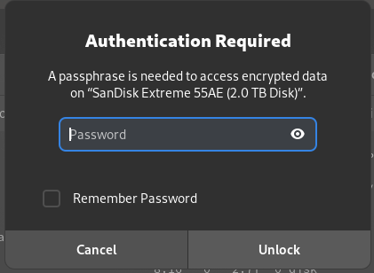
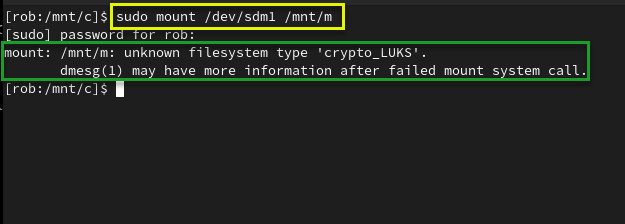
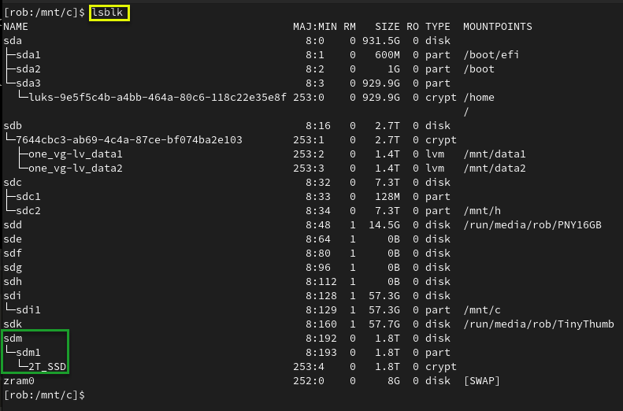
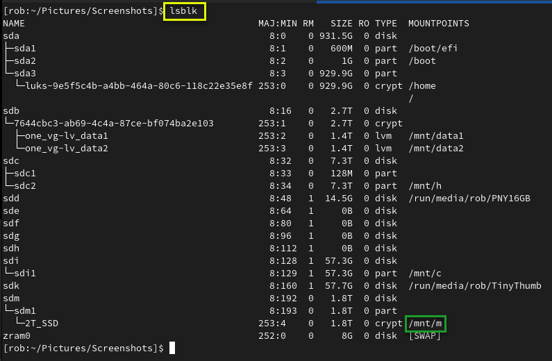
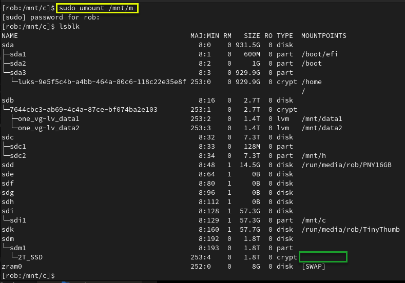

# Mounting and Unmounting a LUKS Encrypted USB Volume
#### This process also works for hard drives.
### Basic commands to view the disks/USB devices:

- blkid
- duf
- lsblk
- lsblk -a
- lsblk -o +UUID,PARTUUID
- lsblk -o +UUID,FSTYPE,PARTUUID
- ls -lF /dev/disk/by-id
- sudo lshw -short -C disk
- sudo udisksctl info -b /dev/??


#### 01. USB drive has not been inserted (plugged in) yet.

To see volumes type:
```
lsblk
```

****<br />

#### 02. GUI password prompt when encrypted drive is plugged in (I clicked cancel to demonstrate mounting from commandline).



#### 03. USB drive inserted (plugged in) and showing as /dev/sdm1.

To see volumes type:
```
lsblk
```

 and showing as /dev/sdm1. Your volume name may be different than /dev/sdm1.")

#### 04. Check the volume information type:

```
sudo udisksctl info -b /dev/sdm1
or
sudo cryptsetup isLuks -v /dev/sdm1
```
The volume /dev/sdm1 shows as "crypto_LUKS".


#### 05. If you try to mount the locked LUKS encrypted volume it will fail. (Screenshot shows mount failed. This is because the volume is locked. Run cryptsetup first to unlock.).



#### 06. Running cryptsetup to unlock the encrypted volume (Assigning alias of "2T_SSD" to reference the unlocked volume. The alias can be whatever you want.).

To open the encrypted filesystem type:

```
sudo cryptsetup luksOpen /dev/sdm1 2T_SSD
```


#### 07. Decrypted volume showing as 2T_SSD, but not yet mounted.

To see the unlocked volume type:
```
lsblk
```



#### 08. Decrypted volume alias "2T_SSD" showing under /dev/mapper.

Check /dev/mapper to see if your alias is there:

```
ls -al /dev/mapper
```


#### 09. Password prompt when using sudo to mount decrypted 2T_SSD volume to /dev/m.

To mount your alias to a mount point type:
```
sudo mount /dev/mapper/2T_SSD /mnt/m
```


#### 10. Decrypted volume showing unlocked and mounted at /mnt/m.

To see volumes type:
```
lsblk
```



#### 11. Unmounting /mnt/m.

To unmount the volume type:
```
sudo umount /mnt/m
```



#### 12. Closing cryptsetup session (Locking it).

To close the volume type:
```
sudo cryptsetup close 2T_SSD
```

.")

#### 13. USB drive unmounted and unplugged from system.

To see volumes type:
```
lsblk
```


### Mount a USB volume and use umask to allow "other" full access.

```
sudo mount /dev/sdi1 /mnt/i -o umask=000,utf8
```

### You can automatically mount by UUID if you want the mount points to consistently mount to the same device. Each partition on a drive will have its own UUID.
Use this to find the UUID:
```
lsblk -o +UUID,PARTUUID
```

```
In fstab;
	UUID=FC3E-233D /mnt/i auto   user,umask=000,utf8  0   0
	UUID=B06E-CC89 /mnt/c auto   user,umask=000,utf8  0   0
	UUID=02608207608201A1 /mnt/h auto   user,umask=000,utf8  0   0

	After editing the fstab file, run 'systemctl daemon-reload' to update systemd
```